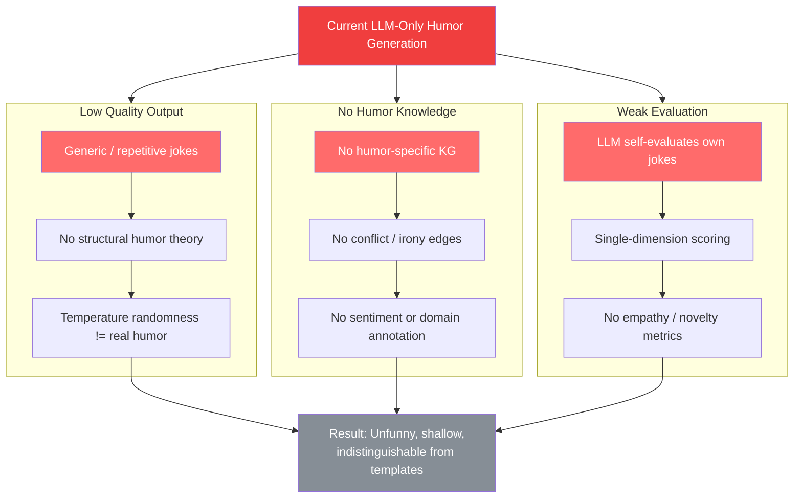
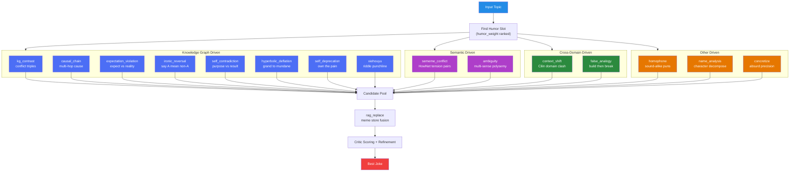
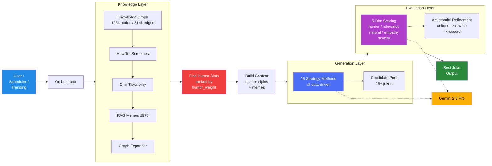
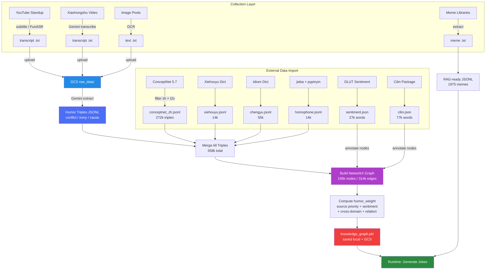
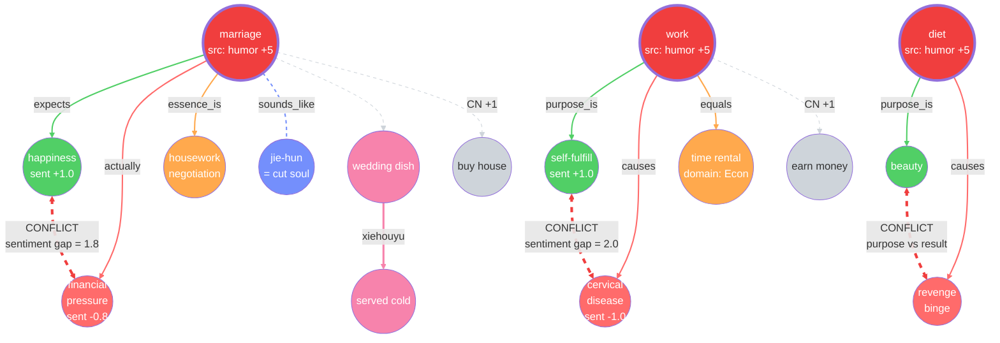
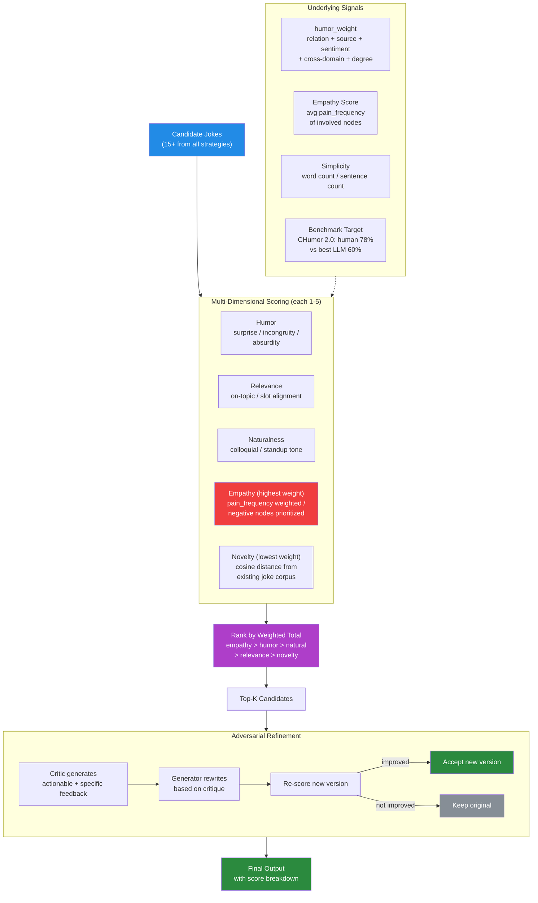
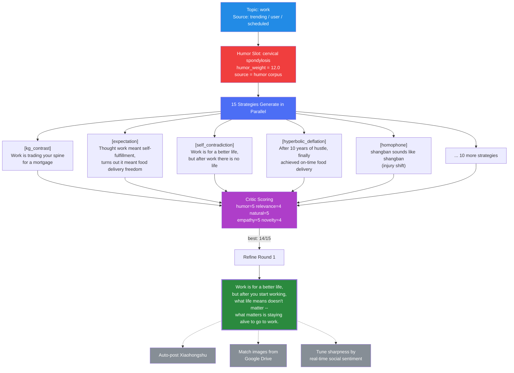

# Humor Generator - System Diagrams

## 1. Problem Statement

## 2. Strategy Overview

## 3. System Architecture

## 4. Data Flow

## 5. Ideal Knowledge Graph

## 6. Evaluation Framework

## 7. Final Output Vision

